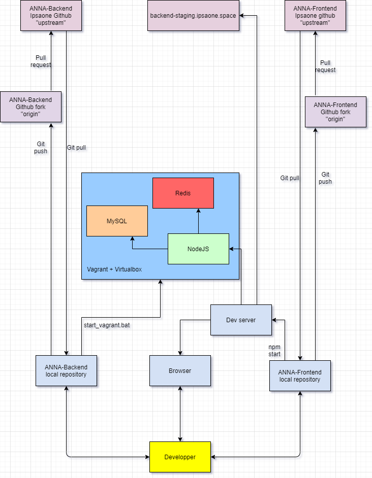
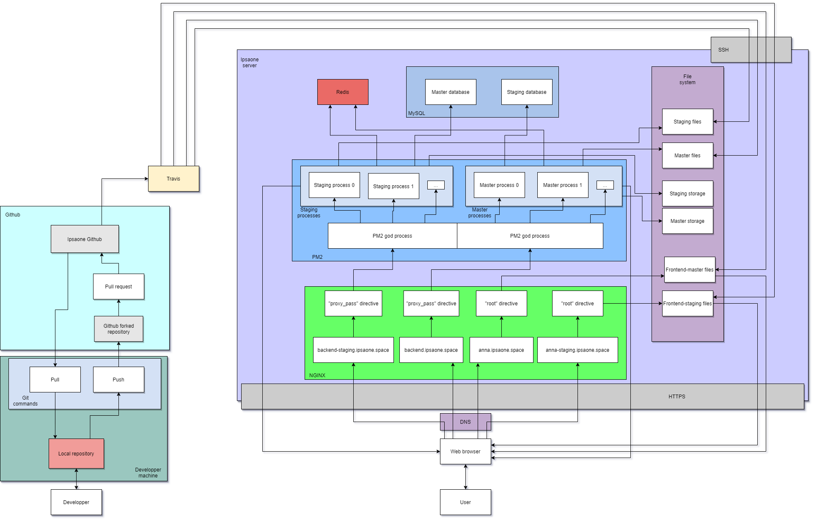

# ANNA-Backend

The backend server for ANNA (Administration Network for Nanosatellite Associations), which is IPSA ONE's internal team management tool.

## Getting Started

These instructions will get you a copy of the project up and running on your local machine for development and testing purposes. The details of the architecture are pictured below.





### Prerequisites

- Vagrant + Virtualbox
 

### Installing


Clone the repository

```
git clone https://github.com/ipsaone/ANNA-Backend.git
```

Move in and boot the vagrant box

```
cd ANNA-Backend
vagrant up
```

Wait for it to boot (will take a while at first), and finally start the server

```
vagrant ssh
cd ANNA-Backend
npm start
```

It should output a message containing the IP and port the server is listening to

## Running the tests

```
npm run test
```

## Built With

* [Express](https://expressjs.com/) - The web framework used
* [NodeJS & NPM](https://nodejs.org/en/) - Dependency Management
* [Redis](https://redis.io/) - Cache & session store
* [MySQL](https://www.mysql.com/fr/) - Database
* [Virtualbox & Vagrant](https://www.vagrantup.com/) - Development environment

## Contributing

Any pull request is welcome !

## Versioning

We use [SemVer](http://semver.org/) for versioning. 

## Authors

* **IPSA ONE** - *Development team* - [ANNA Development team](https://github.com/orgs/ipsaone/teams/anna)

See also the list of [contributors](https://github.com/ipsaone/ANNA-Backend/graphs/contributors) who participated in this project.

## License

This project is licensed under the MIT License - see the [LICENSE.md](LICENSE.md) file for details